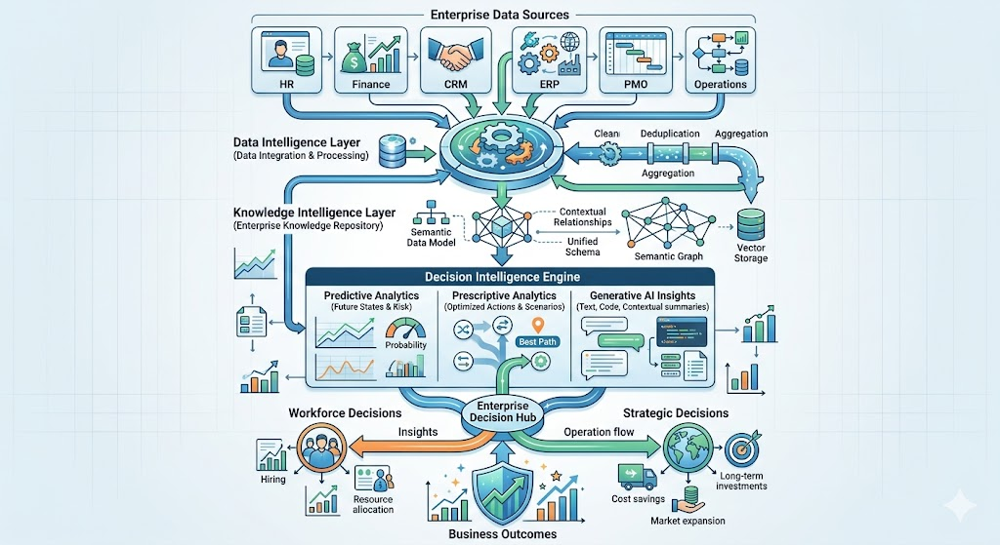
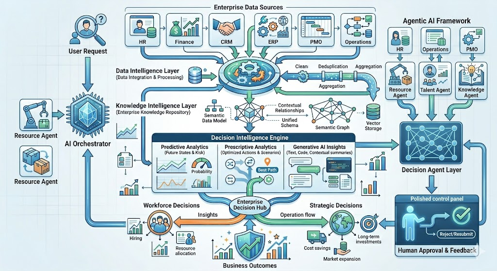

# Enterprise Decision Intelligence

A research-focused repository exploring how Artificial Intelligence, Agentic AI, and Decision Intelligence can transform enterprise operations, workforce management, and strategic business decision-making.

## Research Themes

- Agentic AI for Enterprise Systems
- Enterprise Decision Intelligence
- Talent Intelligence & Workforce Optimization
- AI-Augmented Project Delivery
- Intelligent Enterprise Automation
- Digital Transformation
- Enterprise SaaS Platforms

## Objectives

- Develop practical frameworks for AI-driven decision-making
- Explore enterprise applications of Agentic AI
- Improve workforce planning and resource optimization
- Enable intelligent business operations through data-driven insights

## Areas of Application

- Human Resources
- Talent Acquisition
- Project Management
- Service Delivery
- Enterprise Operations
- Knowledge Management
- Strategic Planning

## Author

**Venkatraman Viswanathan**

- PMP®
- IEEE Senior Member
- Fellow of the Royal Society of Arts (FRSA)
- Fellow of IETE (FIETE)

🌐 Portfolio: https://venkatramanlabs.com

## Architecture Diagrams

### Enterprise Decision Intelligence Architecture

A conceptual framework demonstrating how enterprise data, knowledge systems, analytics, and AI-powered intelligence support strategic, operational, and workforce decision-making.

### Enterprise Decision Intelligence & Agentic AI Framework

A framework illustrating how specialized AI agents collaborate with enterprise intelligence systems and human decision-makers to enable intelligent business operations.

